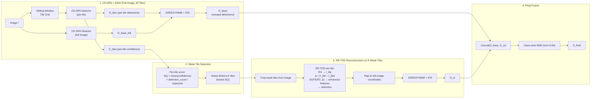

# Complete Framework Guide: Confidence-Guided SAHI with CD-DPA Detection
**Date**: March 10, 2026  
**Project**: Small Object Detection for UAV Imagery (VisDrone Dataset)

---

## Table of Contents

1. [Framework Overview](#framework-overview)
2. [Pipeline Architecture](#pipeline-architecture)
3. [Machine Learning Models](#machine-learning-models)
4. [Mathematical Formulation](#mathematical-formulation)
5. [Implementation Details](#implementation-details)
6. [Training Procedures](#training-procedures)
7. [Evaluation Results](#evaluation-results)
8. [Usage Guide](#usage-guide)
9. [Ablation Study Plan](#ablation-study-plan)
10. [Future Work](#future-work)

---

## Framework Overview

### Core Design Philosophy

The key insight driving this framework: **the detector itself is the best judge of where it fails — use its confidence directly**.

Traditional SAHI runs on all tiles uniformly — expensive and redundant on background regions. Prior versions of this pipeline used an extra ReconstructionHead attached to the detector to produce a Δ failure map, but that is an **indirect proxy** (pixel reconstruction error ≠ detection quality). This redesign eliminates the reconstructor from Stage 1 entirely.

Instead, **CD-DPA runs with SAHI tiling in the first stage**. Each tile produces detection results with confidence scores — tiles where CD-DPA found few or low-confidence objects are the ones where it struggled. These weak tiles are the **direct, ground-truth failure signal** from the detector itself. Only those K weak tiles proceed to Stage 2 for SR-TOD difference-map reconstruction and re-detection.

#### Key advantages over previous design:
- **Direct signal**: Per-tile detection confidence is actual detection performance, not a pixel-level proxy
- **No extra parameters**: Eliminates the ReconstructionHead (~1.2M params) from Stage 1
- **Better CD-DPA standalone performance**: SAHI already boosts recall for small objects
- **Simpler training**: CD-DPA trains as a pure detector — no reconstruction loss needed



### Comparison with Previous Approach

| Aspect | Old Pipeline (5-Stage) | New Pipeline (4-Stage) |
|---|---|---|
| Stage 1 detector | CD-DPA on full image only | CD-DPA + SAHI (full image + tiles) |
| Failure signal | Indirect: ReconstructionHead Δ map | Direct: per-tile detection confidence |
| Extra params in Stage 1 | ReconstructionHead (~1.2M) | None |
| Tile selection | Δ + U_det + M_cheap (triple signal) | Per-tile confidence score (single, direct) |
| CD-DPA standalone mAP | Lower (full-image only) | Higher (SAHI boosts small-object recall) |
| Reconstruction | Stage 1 (RH on P2) + Stage 4 (SR-TOD) | Stage 3 only (SR-TOD on weak tiles) |
| Pipeline stages | 5 stages | 4 stages (simpler) |
| When SR-TOD runs | On top-K Δ-scored tiles | On bottom-K confidence-scored tiles |
| Training complexity | CD-DPA + RH + SR-TOD | CD-DPA (pure detector) + SR-TOD |

### Performance Summary

| Component | Status | Performance | Notes |
|---|---|---|---|
| **Baseline Faster R-CNN** | Trained | 38.02% mAP@0.5 | ResNet50-FPN, reference |
| **CD-DPA Detector** | Needs retraining | ~49–50% mAP@0.5 (projected) | Cascaded deformable attention |
| **CD-DPA + SAHI** | To implement | Higher than standalone | Direct tile-level confidence signal |
| **SR-TOD (weak tiles)** | To integrate | Diff-map reconstruction | Only runs on bottom-K weak tiles |
| **SAHI Merge** | Operational | +34% detections over base | GREEDYNMM + IOS |

---

## Pipeline Architecture

### Stage 1 — CD-DPA + SAHI (Full Image + All Tiles)

CD-DPA runs on both the full image and SAHI tiles in a single stage. This serves dual purpose: (1) produce the best possible base detections, and (2) generate per-tile confidence scores that directly reveal where the detector struggled.

**Process**:
1. Generate a sliding-window tile grid over the image (e.g., 320×320 tiles with 25% overlap)
2. Run CD-DPA on the full image → `D_base_full`
3. Run CD-DPA on each tile → per-tile detections + per-tile confidence scores
4. Merge full-image + tile detections with GREEDYNMM → `D_base`
5. Record per-tile confidence `C_tiles` for Stage 2

**Outputs**:
- `D_base`: merged detections (full-image + tile, after GREEDYNMM + IOS merge)
- `C_tiles`: per-tile confidence vector — mean confidence × detection density per tile

**Why CD-DPA + SAHI together**: CD-DPA on the full image alone downsamples small objects to near-invisible feature sizes. SAHI tiles feed the detector higher-resolution crops where 10px objects become proportionally much larger. The SAHI pass also doubles as a built-in failure probe — no extra reconstructor needed.

```python
# Stage 1: CD-DPA + SAHI
D_base_full = cddpa_detector.predict(image)          # full-image pass

tile_grid = generate_tiles(image, tile_size=320, overlap=0.25)
tile_detections = []
tile_confidences = []

for tile in tile_grid:
    I_tile = crop(image, tile)
    dets = cddpa_detector.predict(I_tile)
    dets = remap_to_full_coords(dets, tile.offset)
    tile_detections.append(dets)
    
    # Per-tile confidence: direct failure signal
    if len(dets['scores']) > 0:
        c_i = dets['scores'].mean().item()
    else:
        c_i = 0.0  # no detections = likely failure
    tile_confidences.append(c_i)

# Merge all detections
D_base = greedynmm_merge([D_base_full] + tile_detections, iou_thresh=0.5)
C_tiles = tile_confidences  # used in Stage 2
```

---

### Stage 2 — Weak Tile Selection

Identify the K tiles where CD-DPA performed worst. The per-tile confidence from Stage 1 is the direct signal — no reconstruction error proxy, no cheap signals, no alpha balancing needed.

**Tile scoring**:
```
S(i) = mean_confidence(tile_i) × detection_count(tile_i) / expected_count
```

Tiles with **lowest S(i)** are the weakest — either no objects detected (S=0) or only low-confidence detections. These are selected for SR-TOD reconstruction.

```python
def select_weak_tiles(tile_grid, C_tiles, tile_detections, K=10, min_expected=2):
    """Select bottom-K tiles by confidence score"""
    scores = []
    for i, tile in enumerate(tile_grid):
        conf = C_tiles[i]
        n_dets = len(tile_detections[i]['boxes'])
        density_factor = min(n_dets / min_expected, 1.0)  # 0 if no detections
        s_i = conf * density_factor
        scores.append(s_i)
    
    # Bottom-K: lowest scores = weakest tiles
    indices = sorted(range(len(scores)), key=lambda i: scores[i])[:K]
    weak_tiles = [tile_grid[i] for i in indices]
    return weak_tiles
```

**Why this is better than Δ + U_det + M_cheap**:
- **1 signal vs 3**: Simpler, no alpha hyperparameter to tune
- **Direct**: Confidence score = actual detection performance (not a pixel reconstruction proxy)
- **Zero cost**: The confidence scores are a free byproduct of Stage 1

---

### Stage 3 — SR-TOD Reconstruction on K Weak Tiles

Run **SR-TOD** (Self-Reconstructed Tiny Object Detection) exclusively on the K weak tiles identified in Stage 2. SR-TOD uses difference-map guided feature enhancement to recover details that CD-DPA missed.

**SR-TOD per-tile process**:
1. Extract backbone features (P2) from the tile crop
2. ReconstructionHead: P2 → reconstructed tile `r_tile`
3. Difference map: `Δ = |r_tile − I_tile|` — highlights where backbone lost information
4. DGFE: uses Δ to enhance P2 features specifically where information was lost
5. Detection head: runs on DGFE-enhanced features → detections

```python
weak_tile_detections = []
for tile in weak_tiles:
    I_tile = crop(image, tile)
    
    # SR-TOD: reconstruction + difference-guided detection
    dets = srtod_detector.predict(I_tile)
    # SR-TOD internally does:
    #   P2 = backbone(I_tile)
    #   r_tile = reconstruction_head(P2)
    #   delta = |r_tile - I_tile|           # difference map
    #   P2_enhanced = dgfe(P2, delta)       # guided enhancement
    #   dets = detection_head(P2_enhanced)  # detect on enhanced features
    
    dets = remap_to_full_coords(dets, tile.offset)
    weak_tile_detections.append(dets)

# Merge SR-TOD tile detections
D_sr = greedynmm_merge(weak_tile_detections, iou_thresh=0.5)
```

**Why SR-TOD only on weak tiles (not everywhere)**:
- SR-TOD is expensive (RH + DGFE per tile)
- Most tiles are already well-detected by CD-DPA+SAHI in Stage 1
- Focusing SR-TOD on K weak tiles maximizes improvement per compute dollar

---

### Stage 4 — Final Fusion

Combine Stage 1 detections (CD-DPA+SAHI) with Stage 3 detections (SR-TOD on weak tiles). Apply class-wise NMS to remove redundancy.

```python
all_boxes  = torch.cat([D_base['boxes'],  D_sr['boxes']])
all_scores = torch.cat([D_base['scores'], D_sr['scores']])
all_labels = torch.cat([D_base['labels'], D_sr['labels']])

D_final = class_wise_nms(all_boxes, all_scores, all_labels, iou_threshold=0.65)
```

**Two distinct merge stages in the full pipeline**:

| Stage | Location | Method | Purpose |
|---|---|---|---|
| SAHI tile merge | Inside Stage 1 | GREEDYNMM + IOS | Remove across-tile duplicates from CD-DPA |
| SR-TOD tile merge | Inside Stage 3 | GREEDYNMM + IOS | Remove across-tile duplicates from SR-TOD |
| Final fusion | Stage 4 | Class-wise NMS (IoU=0.65) | Suppress redundancy between D_base and D_sr |

**Note**: IoU=0.65 is borderline aggressive for dense pedestrian clusters.
If final recall is lower than expected, test IoU in {0.50, 0.55, 0.60}.

---

## Machine Learning Models

### Model 1: CD-DPA Detector

**Purpose**: Base detector for Stage 1 (full-image + SAHI tile detection). Per-tile confidence from this stage drives weak-tile selection for SR-TOD in Stage 3.

**Architecture**: Cascaded Deformable Dual-Path Attention on Faster R-CNN backbone.

```
Input Image (3 x H x W)
    |
ResNet50-FPN Backbone
    ├── P2: 256 x H/4  x W/4
    ├── P3: 256 x H/8  x W/8
    ├── P4: 256 x H/16 x W/16
    └── P5: 256 x H/32 x W/32
    |
CD-DPA Enhancement (P2, P3, P4)
    |
    ├── [Stage 1: Deformable DPA]
    │   ├── Offset Prediction: Conv(256->18)  # 3x3 deformable grid
    │   ├── Deformable Conv: adaptive sampling receptive field
    │   ├── Edge Pathway: DepthwiseConv(3x3) + DepthwiseConv(5x5) -> Spatial Attn
    │   ├── Semantic Pathway: GlobalAvgPool -> FC(256->16->256) -> Channel Attn
    │   └── Fusion: (Edge x Feat) + (Semantic x Feat) -> Conv -> Output_1
    │
    ├── [Stage 2: Refinement DPA]  <-- gradient checkpointing here
    │   └── Same as Stage 1 -> Output_2
    │
    └── [Multi-Scale Fusion]
        ├── Concat(Output_1, Output_2) -> 512 channels
        ├── FusionConv(512->256) + BN + ReLU
        └── Residual add -> Enhanced Features
    |
RPN + RoI Align + Detection Head
    ├── Box Regression: 4 coords per class
    └── Classification: 11 classes (10 + background)
```

**Specifications**:

| Property | Value |
|---|---|
| Base backbone parameters | 41.3M (ResNet50-FPN) |
| CD-DPA module parameters | ~7M (x3 levels) |
| Total parameters | ~48.2M |
| Training epochs planned | 50 |
| Training epochs complete | 12 |
| Mixed precision | FP16 |
| Gradient checkpointing | Enabled on Stage 2 |

**Memory Budget**:
```
Base Faster R-CNN:           8 GB
CD-DPA modules (P2,P3,P4):   6 GB
Forward pass activations:     4 GB
Gradients (checkpointing):   3 GB
Optimizer states (AdamW):    2 GB
Buffer headroom:             1 GB
──────────────────────────────────
Total FP32:                 24 GB
With FP16:               18-20 GB
```

**Projected performance**: ~49–50% mAP@0.5, a +11–12 pp gain over baseline.

**Class-wise baseline reference (Faster R-CNN, 38.02% overall)**:

| Class | AP@0.5 | Instances |
|---|---|---|
| Car | 77.6% | 15,683 |
| Bus | 48.5% | 421 |
| Pedestrian | 47.1% | 8,844 |
| Motor | 44.3% | 4,129 |
| Van | 42.9% | 2,914 |
| People | 37.2% | 5,125 |
| Truck | 34.6% | 1,543 |
| Tricycle | 24.8% | 1,048 |
| Bicycle | 22.4% | 1,287 |
| Awning-tricycle | 1.0% | 532 |

**Files**:
- `models/cddpa_model.py`
- `models/enhancements/cddpa_module.py`
- `scripts/train/14_train_cddpa.py`
- `results/outputs_cddpa/checkpoint_epoch_12.pth`

---

### Model 2: SR-TOD (Self-Reconstructed Tiny Object Detector)

**Purpose**: Tile-level detector for Stage 3. Runs only on weak tiles where CD-DPA struggled. Combines RH + DGFE + Faster R-CNN to recover details via difference-map guided feature enhancement.

**Architecture**: Based on ECCV 2024 SR-TOD paper.

```
Weak Tile Image (3 x h x w)
    |
ResNet50-FPN Backbone → P2
    |
ReconstructionHead(P2) → r_tile (reconstructed tile)
    |
Δ = |r_tile − I_tile|  (difference map — highlights lost information)
    |
DGFE(Δ, P2) → Enhanced P2 features
  ├── Learnable threshold filtration (masks noise in Δ)
  └── Channel attention on Δ-masked features
    |
Faster R-CNN RPN + RoI Head → Tile Detections
    |
Joint Loss = L_det + λ·L1(r_tile, I_tile)
```

**ReconstructionHead inside SR-TOD**:
```
P2 FPN Features (256 x H/4 x W/4)
    |
ConvTranspose2d(256→128, k=2, s=2)  →  128 x H/2 x W/2 + BN + ReLU
ConvTranspose2d(128→64, k=2, s=2)   →  64 x H x W + BN + ReLU
Conv2d(64→3, k=3, p=1) + Sigmoid    →  3 x H x W  (reconstructed tile)
```

**Key point**: The ReconstructionHead exists **only inside SR-TOD** (Stage 3), not in the CD-DPA detector (Stage 1). CD-DPA is a pure detector; SR-TOD uses reconstruction to guide its feature enhancement.

**Specifications**:

| Property | Value |
|---|---|
| SR-TOD total parameters | ~43M (backbone + RH + DGFE + det head) |
| RH parameters alone | ~1.2M |
| Training method | Joint: L1 reconstruction + Faster R-CNN detection losses |
| Inference scope | Only K weak tiles (not full image) |

**Files**:
- `models/srtod_model.py`
- `models/enhancements/reconstruction_head.py`
- `models/enhancements/dgfe_module.py`
- `scripts/train/11_train_srtod.py`
- `results/outputs_srtod/best_model_srtod.pth`

---

## Mathematical Formulation

### Per-Tile Confidence Score (Stage 2)

After CD-DPA+SAHI in Stage 1, each tile has detections with confidence scores. The per-tile weakness score:

```
S(i) = mean_conf(tile_i) × min(n_dets(tile_i) / n_expected, 1.0)
```

Where:
- `mean_conf(tile_i)` = average detection confidence in tile i (0 if no detections)
- `n_dets(tile_i)` = number of detections in tile i
- `n_expected` = minimum expected detections per tile (hyperparameter, default=2)

**Weak tiles**: Bottom-K tiles by S(i) are selected for SR-TOD reconstruction.

```
weak_tiles = argsort({S(i)}_{i=1}^{N})[:K]   # lowest scores = weakest
```

### SR-TOD Difference Map (Stage 3, per weak tile)

Inside SR-TOD, the ReconstructionHead produces a difference map per tile:

```
r_tile = ReconstructionHead(P2_tile)    # P2 from SR-TOD backbone on tile crop
Δ(x,y) = (1/3) · sum_{c in {R,G,B}} |I_tile(x,y,c) - r_tile(x,y,c)|
```

DGFE uses Δ to enhance features where information was lost:
```
P2_enhanced = DGFE(P2_tile, Δ)         # Δ-guided feature enhancement
```

### GREEDYNMM Merge

Confidence-weighted box averaging for tile-boundary objects:
```
b_merged = sum_j (s_j · b_j) / sum_j (s_j)    for overlapping boxes {b_j}
```

### IOS Metric

```
IOS(b_i, b_j) = |b_i ∩ b_j| / min(|b_i|, |b_j|)
```

IOS = 1.0 when one box fully contains another — handles partial tile-edge views.

### Final Fusion (Stage 4)

```
D_final = ClassWiseNMS(Concat(D_base, D_sr), iou_threshold=0.65)
```

---

## Implementation Details

### Project Structure

```
small-object-detection/simple implementation/
├── configs/
│   ├── base_config.py                 # Shared hyperparameters
│   ├── sahi_config.py                 # Pipeline config + presets
│   └── dpa_config.py                  # CD-DPA config

├── models/
│   ├── baseline.py                    # Baseline Faster R-CNN (reference)
│   ├── cddpa_model.py                 # Full CD-DPA Faster R-CNN
│   ├── srtod_model.py                 # SR-TOD (RH + DGFE + Faster R-CNN)
│   ├── enhancements/
│   │   ├── cddpa_module.py            # Cascaded deformable DPA block
│   │   ├── dpa_module.py              # Base DPA block
│   │   ├── reconstruction_head.py     # RH: P2 → r_img (used inside SR-TOD only)
│   │   └── dgfe_module.py             # DGFE: Δ-guided feature enhancement
│   └── sahi_pipeline/
│       ├── __init__.py
│       ├── pipeline.py                # Main orchestration (4 stages)
│       ├── detector_wrapper.py        # CDDPADetector + SRTODTileDetector
│       ├── tiles.py                   # Grid generation + confidence scoring
│       ├── sahi_runner.py             # Tile inference + GREEDYNMM
│       └── fuse.py                    # Final NMS fusion

├── scripts/
│   ├── train/
│   │   ├── 14_train_cddpa.py          # Block 1: CD-DPA training
│   │   ├── 11_train_srtod.py          # Block 2: SR-TOD end-to-end
│   │   └── train_all_blocks.py        # Master runner (both trainable blocks)
│   ├── eval/
│   │   ├── 18_evaluate_cddpa.py
│   │   └── 12_evaluate_srtod.py
│   └── inference/
│       ├── run_sahi_infer.py
│       └── run_sahi_video.py

├── data/
│   └── visdrone_dataset.py

└── analysis/
    ├── 1_understand_dataset.py
    ├── 2_visualize_dataset.py
    ├── 3_annotation_format_analysis.py
    └── verify_reconstructor_calibration.py
```

### Pipeline Configuration

```python
# configs/sahi_config.py
@dataclass
class SAHIPipelineConfig:
    # Stage 1: CD-DPA + SAHI
    cddpa_checkpoint: str = 'results/outputs_cddpa/best_model_cddpa.pth'

    # Tile grid (used by CD-DPA SAHI in Stage 1)
    tile_size: tuple = (320, 320)
    overlap: float = 0.25

    # Stage 2: Weak tile selection
    K: int = 10                      # Number of weak tiles sent to SR-TOD
    min_expected_dets: int = 2       # Expected detections per tile

    # Stage 3: SR-TOD on weak tiles
    srtod_checkpoint: str = 'results/outputs_srtod/best_model_srtod.pth'
    postprocess_type: str = 'GREEDYNMM'
    postprocess_metric: str = 'IOS'
    postprocess_threshold: float = 0.5
    detection_score_thresh: float = 0.4

    # Stage 4: Final fusion
    iou_final: float = 0.65
```

### Preset Configurations

| Setting | Fast | Balanced | Accurate |
|---|---|---|---|
| K | 5 | 10 | 20 |
| tile_size | 256x256 | 320x320 | 512x512 |
| overlap | 0.2 | 0.25 | 0.3 |
| score_thresh | 0.5 | 0.4 | 0.3 |
| min_expected_dets | 2 | 2 | 3 |

### Key Module — pipeline.py

```python
class ConfidenceGuidedSAHIPipeline:
    def process_image(self, image):
        # Stage 1: CD-DPA + SAHI (full image + all tiles)
        tile_grid = self.tiler.generate_grid(image.shape)
        D_base_full = self.cddpa_detector.predict(image)  # full-image pass
        
        tile_detections = []
        tile_confidences = []
        for tile in tile_grid:
            I_tile = crop(image, tile)
            dets = self.cddpa_detector.predict(I_tile)
            dets = remap_to_full_coords(dets, tile)
            tile_detections.append(dets)
            c_i = dets['scores'].mean().item() if len(dets['scores']) > 0 else 0.0
            tile_confidences.append(c_i)
        
        D_base = self.merger.greedynmm([D_base_full] + tile_detections)

        # Stage 2: Select weak tiles (lowest confidence)
        weak_tiles = self.tiler.select_weak(
            tile_grid, tile_confidences, tile_detections,
            K=self.config.K
        )

        # Stage 3: SR-TOD reconstruction on weak tiles only
        D_sr = self.srtod_runner.run_on_tiles(image, weak_tiles)

        # Stage 4: Final fusion
        D_final = self.fuser.fuse(D_base, D_sr)

        return D_final, self._build_metadata(locals())
```

### Module Responsibilities

| Module | File | Role |
|---|---|---|
| ConfidenceGuidedSAHIPipeline | pipeline.py | Orchestrates all 4 stages |
| CDDPADetector | detector_wrapper.py | Stage 1: CD-DPA predict() on full image + tiles |
| SRTODTileDetector | detector_wrapper.py | Stage 3: SR-TOD predict() for weak tiles |
| ConfidenceScoringTiler | tiles.py | Grid gen, confidence scoring, bottom-K selection |
| SAHIInferenceRunner | sahi_runner.py | Tile inference, coord mapping, GREEDYNMM |
| DetectionFusion | fuse.py | Class-wise NMS, final output |

---

## Training Procedures

### 1. CD-DPA Detector

```bash
cd scripts/train
python 14_train_cddpa.py
```

```python
{
    'num_classes':          11,
    'enhance_levels':       ['0', '1', '2'],  # P2, P3, P4
    'use_checkpoint':       True,
    'mixed_precision':      True,
    'batch_size':           4,
    'accumulation_steps':   4,                # Effective batch = 16
    'num_epochs':           50,
    'optimizer':            'AdamW',
    'learning_rate':        1e-4,
    'weight_decay':         1e-4,
    'warmup_epochs':        3,
    'scheduler':            'CosineAnnealingLR',
    'early_stopping_patience': 15
}
```

Resume from checkpoint:
```bash
python 14_train_cddpa.py --resume results/outputs_cddpa/checkpoint_epoch_12.pth
```

**Status**: 12/50 epochs complete. ~10 h remaining on RTX 3090.

---

### 2. SR-TOD (Tile Detector)

```bash
cd scripts/train
python 11_train_srtod.py
```

```python
{
    'architecture': 'FasterRCNN_SRTOD (RH + DGFE + detection)',
    'loss':         'L1_recon + Faster RCNN losses',
    'optimizer':    'SGD',
    'lr':            0.005,
    'batch_size':   4,
    'epochs':       50,
    'scheduler':    'StepLR(step=10, gamma=0.1)'
}
```

**Status**: Previously trained. Best model at `results/outputs_srtod/best_model_srtod.pth`.

### Master Training Runner

Train both blocks sequentially:
```bash
python scripts/train/train_all_blocks.py --all
```

Quick sanity check (2 epochs each):
```bash
python scripts/train/train_all_blocks.py --all --quick
```

**Note**: Only 2 blocks need training now: CD-DPA and SR-TOD. The ReconstructionHead is trained as part of SR-TOD (not standalone).

---

### 3. Baseline Faster R-CNN (reference)

```bash
cd scripts/train
python 5_train_frcnn.py
```

Used as the reference architecture for ablation and for initializing CD-DPA backbone weights.
**Status**: Complete. 38.02% mAP@0.5.

### 4. CD-DPA Evaluation Modes

The CD-DPA evaluation script now supports two modes:

1. Full-image detector-only evaluation (classic):
```bash
python scripts/eval/18_evaluate_cddpa.py
```

2. Stage-1 CD-DPA+SAHI evaluation with Stage-2 weak-tile statistics:
```bash
python scripts/eval/18_evaluate_cddpa.py --use-sahi --batch-size 1
```

Optional SAHI controls:
```bash
python scripts/eval/18_evaluate_cddpa.py \
    --use-sahi \
    --tile-width 320 --tile-height 320 --overlap 0.25 \
    --weak-k 10 --min-expected-dets 2 \
    --postprocess GREEDYNMM --match-metric IOS --match-threshold 0.5
```

Output files:
- Detector-only mode: `results/outputs_cddpa/evaluation_results.json`
- `--use-sahi` mode: `results/outputs_cddpa/evaluation_results_sahi_stage1.json`

`--use-sahi` mode reports both Stage-1 detection metrics and Stage-2 readiness stats (average tile score and weak-tile score), so one pass validates both parts of the pipeline handoff.

---

## Evaluation Results

### Baseline Detector

| Metric | Value |
|---|---|
| mAP@0.5 | 38.02% |
| mAP@0.75 | 19.25% |
| mAP@0.5:0.95 | 17.89% |

### SAHI Pipeline (Forced Trigger, Balanced Preset)

| Metric | Value |
|---|---|
| Detection rate | 75.6% (5-image test set) |
| Base detections | 47 |
| With SAHI | 63 (+34%) |
| SAHI overhead | +365 ms (+46%) |
| GREEDYNMM duplicate removal | 30.5% vs 19% with standard NMS |

### Timing Breakdown (Estimated, Full Pipeline)

| Stage | Latency | Share |
|---|---|---|
| Stage 1: CD-DPA full image | ~788 ms | 35% |
| Stage 1: CD-DPA SAHI tiles (~30 tiles) | ~1200 ms | 53% |
| Stage 1: GREEDYNMM tile merge | ~5 ms | 0.2% |
| Stage 2: Weak tile scoring + K selection | ~1 ms | <0.1% |
| Stage 3: SR-TOD on K=10 weak tiles | ~200 ms | 9% |
| Stage 3: GREEDYNMM SR-TOD merge | ~3 ms | 0.1% |
| Stage 4: Final fusion NMS | ~23 ms | 1% |
| **Total** | **~2220 ms** | — |

**Trade-off**: Stage 1 is slower than before (CD-DPA runs on tiles too, not just full image), but the gains are: (1) significantly higher recall from SAHI, (2) direct confidence-based weak tile selection — no reconstructor needed, (3) fewer tiles sent to SR-TOD since CD-DPA+SAHI already caught most objects.

**Optimization path**: Batch tile inference (run multiple tiles in one forward pass) can reduce Stage 1 latency by ~40%.

---

## Usage Guide

### Quick Start

```python
from models.sahi_pipeline import ConfidenceGuidedSAHIPipeline
from configs.sahi_config import SAHIPipelineConfig
import cv2

config = SAHIPipelineConfig(
    K=10,
    tile_size=(320, 320),
    cddpa_checkpoint='results/outputs_cddpa/best_model_cddpa.pth',
    srtod_checkpoint='results/outputs_srtod/best_model_srtod.pth'
)

pipeline = ConfidenceGuidedSAHIPipeline(config)

image = cv2.cvtColor(cv2.imread('test_image.jpg'), cv2.COLOR_BGR2RGB)
detections, metadata = pipeline.process_image(image)

print(f"Final detections     : {metadata['num_final_dets']}")
print(f"CD-DPA+SAHI base     : {metadata['num_base_dets']}")
print(f"SR-TOD added         : +{metadata['num_sr_dets']}")
print(f"Weak tiles processed : {metadata['K_selected']}")
print(f"Total latency        : {metadata['latency_ms']:.1f} ms")
```

### Metadata Structure

```python
{
    'num_base_dets':  63,         # CD-DPA + SAHI merged
    'num_sr_dets':    8,          # SR-TOD on weak tiles
    'num_final_dets': 68,         # after final NMS

    'K_selected':     10,
    'K_config':       10,
    'total_tiles':    30,

    'latency_ms':    2220.0,
    'timings': {
        'cddpa_full_image': 788.0,
        'cddpa_sahi_tiles': 1200.0,
        'sahi_merge':         5.0,
        'weak_selection':     1.0,
        'srtod_weak_tiles': 200.0,
        'srtod_merge':        3.0,
        'final_fusion':      22.5
    },

    # Intermediate data for visualisation
    'tile_confidences': '[0.0, 0.82, 0.15, ...]',
    'weak_tile_indices': '[0, 2, 7, ...]',
    'weak_tiles':       '[(x0,y0,x1,y1), ...]',
}
```

### Inference Commands

```bash
# Single image
python scripts/inference/run_sahi_infer.py \
    --image path/to/image.jpg \
    --preset balanced \
    --visualize

# Batch directory
python scripts/inference/run_sahi_infer.py \
    --image_dir dataset/VisDrone2019-DET-val/images/ \
    --preset balanced \
    --output_dir results/full_validation/

# Video
python scripts/inference/run_sahi_video.py \
    --video path/to/video.mp4 \
    --preset balanced \
    --output results/video_output.mp4
```

### Visualizing Tile Confidence

```python
import matplotlib.pyplot as plt
import numpy as np

# After pipeline.process_image(image)
tile_confs = metadata['tile_confidences']
weak_indices = metadata['weak_tile_indices']
tile_grid = metadata['tile_grid']

# Draw tiles on image, color-coded by confidence
fig, ax = plt.subplots(1, 1, figsize=(12, 8))
ax.imshow(image)
for i, tile in enumerate(tile_grid):
    x0, y0, x1, y1 = tile
    color = 'red' if i in weak_indices else 'green'
    alpha = 0.6 if i in weak_indices else 0.2
    rect = plt.Rectangle((x0, y0), x1-x0, y1-y0,
                          fill=False, edgecolor=color, linewidth=2, alpha=alpha)
    ax.add_patch(rect)
    ax.text(x0+5, y0+15, f'{tile_confs[i]:.2f}', color=color, fontsize=8)
ax.set_title(f'Tile Confidence Map — {len(weak_indices)} weak tiles (red) → SR-TOD')
plt.tight_layout()
plt.savefig('tile_confidence_map.png')
```

---

## Ablation Study Plan

### A1 — CD-DPA Standalone vs CD-DPA+SAHI

| Configuration | Method | Question answered |
|---|---|---|
| CD-DPA full image only | No SAHI | Baseline CD-DPA performance |
| CD-DPA + SAHI | Full image + tiles | How much does SAHI boost CD-DPA? |
| CD-DPA + SAHI + SR-TOD (K=10) | Full pipeline | Does SR-TOD on weak tiles add value? |

### A2 — Weak Tile Selection Effectiveness

| Configuration | Method | Question answered |
|---|---|---|
| Random K tiles → SR-TOD | Random selection | Is confidence-based selection better than random? |
| Bottom-K confidence → SR-TOD | Our method | Does targeting weak tiles outperform random? |
| All tiles → SR-TOD | No selection | Upper bound (unlimited compute) |

### A3 — NMS Strategy Sensitivity

| Configuration | Tile merge | Final fusion IoU |
|---|---|---|
| Standard NMS | NMS (IoU=0.5) | 0.65 |
| GREEDYNMM + IOS | GREEDYNMM + IOS | 0.65 |
| Final IoU sweep | GREEDYNMM + IOS | {0.50, 0.55, 0.60, 0.65, 0.70} |

### A4 — SR-TOD Budget Efficiency Curve

| Configuration | Weak tiles to SR-TOD | Note |
|---|---|---|
| K=0 (CD-DPA+SAHI only) | 0 | No SR-TOD overhead |
| K=5 | 5 | Fast |
| K=10 (default) | 10 | Balanced |
| K=20 | 20 | Higher recall, slower |
| K=all | All tiles | Max recall, max compute |

Plot mAP@0.5 vs. K to show the efficiency frontier.

### A5 — Tile Size Sensitivity

| tile_size | Approx tiles | Effect |
|---|---|---|
| 256×256 | ~50 | More tiles, finer coverage, slower Stage 1 |
| 320×320 | ~30 | Default balance |
| 512×512 | ~12 | Fewer tiles, faster, less small-object boost |

---

## Future Work

### Priority 1 — Retrain CD-DPA (Full 50 Epochs)

```bash
python scripts/train/14_train_cddpa.py
```

Previous training only reached 12 epochs. Need full training for strong Stage 1 performance.

### Priority 2 — Implement CD-DPA+SAHI Pipeline

Update `pipeline.py` to run CD-DPA on both full image + tiles, record per-tile confidence, and select weak tiles. This is the core architectural change.

### Priority 3 — Retrain/Validate SR-TOD

Ensure SR-TOD works well on tile crops. May need to retrain with tile-sized inputs if trained on full images previously.

### Priority 4 — Adaptive K Budgeting

Replace fixed K with a function of tile confidence distribution:

```python
# Select all tiles below a confidence threshold rather than fixed K
conf_threshold = mean(C_tiles) - std(C_tiles)
weak_tiles = [t for t, c in zip(tiles, C_tiles) if c < conf_threshold]
```

Dense scenes with many low-confidence tiles → more SR-TOD; clean scenes → fewer.

### Priority 5 — Batch Tile Inference

Batch multiple tiles in one forward pass to reduce Stage 1 latency:

```python
tile_batch = torch.stack([crop(image, t) for t in tile_grid[:batch_size]])
dets_batch = cddpa_detector.predict_batch(tile_batch)
```

### Priority 6 — Deployment Optimization

| Target | Optimization | Goal |
|---|---|---|
| RTX 3090 | TensorRT for CD-DPA | 30 FPS video |
| Jetson AGX | INT8 + pruning | Edge deployment |
| Web API | FastAPI + Docker | Cloud serving |

### Priority 7 — Paper Preparation

1. **CD-DPA paper**: "Cascaded Deformable Dual-Path Attention for Small Object Detection in Aerial Imagery" — target CVPR/ICCV
2. **Confidence-Guided SAHI paper**: "Confidence-Guided Selective Reconstruction for Small Object Detection" — target ICIP/ICPR
3. **System paper**: Combined contribution with full ablation for IGARSS/ISPRS

---

## Troubleshooting

### All Tiles Have Similar Confidence (Weak Selection Fails)

Symptom: tile confidence variance < 0.01; weak tile selection is nearly random.

Fixes:
- Lower `detection_score_thresh` so CD-DPA produces more varying scores
- Use a composite score: confidence × detection_density instead of confidence alone
- Fall back to sending all tiles to SR-TOD if variance is too low

### Final NMS Over-Suppresses Dense Clusters

Symptom: Pedestrian AP drops significantly after Stage 4 NMS.

Fix: Lower `iou_final` from 0.65 to 0.50–0.55. This is tested in ablation A3.

### SR-TOD Adds Fewer Than 5% New Detections on Weak Tiles

Possible causes:
1. CD-DPA+SAHI already detected most objects — this is a positive result for CD-DPA
2. SR-TOD model not well trained — check reconstruction L1 loss and DGFE threshold
3. Weak tile selection is selecting background tiles — inspect tile confidence distribution

### Stage 1 Too Slow (CD-DPA on All Tiles)

Fixes:
- Batch tile inference (multiple tiles per forward pass)
- Use larger tile_size (512 instead of 320) for fewer tiles
- Reduce overlap from 0.25 to 0.15

---

## Key References

1. Ren et al., "Faster R-CNN", NIPS 2015
2. Lin et al., "Feature Pyramid Networks for Object Detection", CVPR 2017
3. Akyon et al., "Slicing Aided Hyper Inference and Fine-tuning for Small Object Detection", ICIP 2022
4. Dai et al., "Deformable Convolutional Networks", ICCV 2017
5. Hu et al., "Squeeze-and-Excitation Networks", CVPR 2018
6. Zhu et al., "Vision Meets Drones: Past, Present and Future", arXiv 2020

---

**Last Updated**: March 10, 2026  
**Status**: 4-stage pipeline redesigned; CD-DPA+SAHI in Stage 1 with confidence-guided weak tile selection for SR-TOD  
**Next Steps**: Retrain CD-DPA (50 epochs) → Implement CD-DPA+SAHI pipeline → Validate SR-TOD on weak tiles → Full ablation → Paper preparation

---

## Appendix A: Detailed Component-Level Architecture Notes (Code-Aligned)

This appendix expands the main sections with implementation-level detail, mathematical notation, tensor shapes, and diagram guidance for paper writing.

### A.1 Architecture Taxonomy: Backbone, Neck, and Head

In this project, the detector family is **Faster R-CNN**. It is important to separate terms clearly:

1. **Backbone**: convolutional feature extractor (ResNet-50 body)
2. **Neck**: multi-scale feature fusion (FPN)
3. **Head**: RPN + RoI box/classification heads

In torchvision-style implementation, the backbone and neck are packaged together as a ResNet50-FPN backbone module. So saying "backbone" in code often means "body + FPN neck".

### A.2 End-to-End Pipeline Data Flow

Let the input image be:

$$
I \in \mathbb{R}^{3 \times H \times W}
$$

The pipeline is:

1. Stage 1: CD-DPA + SAHI -> base detections $D_{base}$
2. Stage 2: confidence-guided weak-tile selection -> weak tile set $\mathcal{W}$
3. Stage 3: SR-TOD on weak tiles -> refinement detections $D_{sr}$
4. Stage 4: class-wise fusion -> final detections $D_{final}$

Detection dictionary format at all stages:

$$
D = \{\text{boxes} \in \mathbb{R}^{N\times4},\; \text{scores} \in \mathbb{R}^{N},\; \text{labels} \in \mathbb{Z}^{N}\}
$$

### A.3 Stage 1 Internals: CD-DPA + SAHI

#### A.3.1 Correct operation order

For each full image or tile crop, the internal order is:

1. GeneralizedRCNN transform (resize/normalize/pad)
2. ResNet50-FPN feature extraction
3. CD-DPA enhancement on $P2, P3, P4$
4. RPN proposals
5. RoI heads
6. score-threshold filtering

So this is **not** "CD-DPA before Faster R-CNN". CD-DPA is inserted in the Faster R-CNN feature path.

#### A.3.2 Multi-scale features

For input $(H, W)$, FPN feature sizes are:

1. $P2: 256 \times H/4 \times W/4$
2. $P3: 256 \times H/8 \times W/8$
3. $P4: 256 \times H/16 \times W/16$
4. $P5: 256 \times H/32 \times W/32$

CD-DPA is applied to $P2, P3, P4$ (levels 0/1/2) because these levels are most critical for tiny-to-small objects.

#### A.3.3 SAHI branch in Stage 1

Tile grid defaults:

1. tile size: $(320, 320)$
2. overlap ratio: $0.25$
3. stride: $(240, 240)$ approximately

The system runs both:

1. full-image CD-DPA pass
2. per-tile CD-DPA passes

Then detections are remapped into full-image coordinates and merged by GREEDYNMM + IOS.

### A.4 Stage 2 Weak-Tile Scoring and Selection

For tile $i$:

1. mean confidence: $\bar{c}_i$
2. detection count: $n_i$
3. expected count hyperparameter: $n_{exp}$

Weakness score:

$$
S(i) = \bar{c}_i \cdot \min\left(\frac{n_i}{n_{exp}}, 1.0\right)
$$

Selection rule:

$$
\mathcal{W} = \text{BottomK}\left(\{S(i)\}_{i=1}^{N_{tiles}}\right)
$$

Interpretation:

1. $S(i)=0$ often means no detections (hard/weak tile)
2. low $S(i)$ means low-confidence and/or sparse detections
3. bottom-$K$ tiles are sent to SR-TOD

### A.5 Stage 3 SR-TOD: Reconstruction-Guided Refinement

Stage 3 runs only on weak tiles $\mathcal{W}$.

For each weak tile $I_t$:

1. extract FPN features and take $P2_t$
2. ReconstructionHead predicts reconstructed tile $r_t$
3. build difference map $\Delta_t$
4. DGFE uses $(P2_t, \Delta_t)$ to produce enhanced features
5. run RPN + RoI heads with enhanced $P2_t$

#### A.5.1 Reconstruction map formulation

$$
r_t = RH(P2_t), \quad r_t \in [0,1]^{3 \times h \times w}
$$

$$
\Delta_t(x,y) = \frac{1}{3}\sum_{c\in\{R,G,B\}} \left|I_t^{(c)}(x,y)-r_t^{(c)}(x,y)\right|
$$

Thus:

$$
\Delta_t \in \mathbb{R}^{1 \times h \times w}
$$

#### A.5.2 DGFE formulation

Given learnable threshold $\tau$:

$$
M_t = \frac{\operatorname{sign}(\Delta_t-\tau)+1}{2}
$$

Resize mask to feature resolution and compute channel attention scale $A_t$.

Feature enhancement can be interpreted as:

$$
    ilde{P2}_t = (P2_t \odot A_t) + (P2_t \odot A_t \odot M_t)
$$

This preserves baseline semantics while emphasizing regions with high reconstruction discrepancy.

### A.6 Stage 4 Final Fusion

Concatenate Stage 1 and Stage 3 detections:

$$
D_{all} = D_{base} \cup D_{sr}
$$

Apply class-wise NMS:

$$
D_{final} = \text{ClassWiseNMS}(D_{all}, \text{IoU}=0.65)
$$

Important: the final stage is a **fusion stage**, not an additional DPA head.

### A.7 Merge and Overlap Metrics

#### A.7.1 IOS metric

$$
IOS(b_i,b_j)=\frac{|b_i \cap b_j|}{\min(|b_i|,|b_j|)}
$$

IOS is effective for tile-boundary cases where one box is partial and one is full.

#### A.7.2 GREEDYNMM intuition

Instead of hard suppression like vanilla NMS, GREEDYNMM groups overlapping boxes and keeps representative high-confidence candidates, reducing duplicated detections across overlapping tiles.

### A.8 Training Behavior and Freezing Policy

CD-DPA training script uses temporary backbone freezing for stability at startup:

1. freeze backbone for initial epochs
2. unfreeze backbone for full fine-tuning

Current training config:

1. `freeze_backbone_epochs = 5`
2. from epoch 6 onward, backbone is unfrozen

So the backbone is **not permanently frozen**.

### A.9 Practical Diagram Wording (Recommended)

To avoid reviewer confusion, prefer these labels:

1. `ResNet50 Backbone + FPN Neck`
2. `CD-DPA Enhancement (P2/P3/P4)`
3. `RPN + RoI Detection Head`
4. `Stage-1 SAHI Merge (GREEDYNMM + IOS)`
5. `Weak Tile Scoring S(i)`
6. `Bottom-K Selection`
7. `SR-TOD: RH -> Delta -> DGFE(P2, Delta)`
8. `Final Fusion: Class-wise NMS`

### A.10 Suggested Claims You Can Defend in Paper

1. The weak-tile signal is detector-native (confidence-derived), not proxy-derived.
2. Reconstruction is selectively used only where detector quality is low.
3. P2-focused guidance targets tiny-object failures while preserving full Faster R-CNN multi-scale detection path.
4. Final stage is lightweight and robust due to class-wise fusion rather than another heavy feature module.

### A.11 Limitations and Design Trade-offs

1. Stage 1 latency increases with dense tiling.
2. Overly high final NMS IoU can suppress dense pedestrian clusters.
3. If tile confidence variance collapses, weak-tile selection becomes less discriminative.

These are already addressable with adaptive $K$, threshold tuning, and tile batching.
