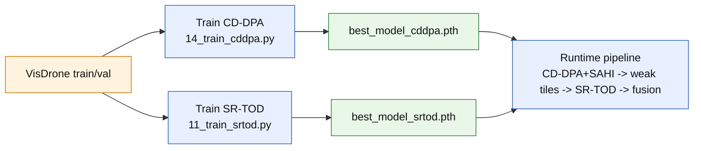

# Full Framework Diagram (Presentation-Ready)

This file is designed for slides/report copy-paste.
It emphasizes:
- frozen/pretrained backbone blocks,
- your custom blocks,
- compact technical details (feature sizes, map sizes, thresholds).

## Legend

- `Frozen/Pretrained`: gray dashed style
- `Custom (Your Block)`: green style
- `Standard Detector Ops`: blue style
- `Data/Decision Nodes`: orange style

---

## 1) Full 4-Stage Pipeline (End-to-End)

```mermaid
flowchart LR
    classDef frozen fill:#f2f2f2,stroke:#666,stroke-dasharray: 5 5,color:#111;
    classDef custom fill:#e8f7e8,stroke:#2e7d32,stroke-width:2px,color:#111;
    classDef standard fill:#e8f0ff,stroke:#2f5fb3,color:#111;
    classDef data fill:#fff3e0,stroke:#c77700,color:#111;

    I[Input Image\n3 x H x W]:::data

    subgraph S1[Stage 1: CD-DPA + SAHI [checkpoint-loaded]]
        BB1[ResNet50-FPN Backbone\nP2..P6, C=256\nPretrained/Frozen at inference]:::frozen
        CD0[CD-DPA on P2/P3/P4\nEnhanced levels: 0,1,2]:::custom
        FULL[Full-image detections\nD_base_full]:::standard

        TILER[Tile Grid\nsize=320x320\noverlap=0.25]:::data
        TILEINF[CD-DPA per tile\nmean confidence per tile]:::custom
        REMAP[Remap tile boxes\nto full coords]:::standard
        MERGE1[GREEDYNMM + IOS\nStage-1 merge]:::standard
        DBASE[D_base]:::data
    end

    subgraph S2[Stage 2: Weak Tile Selection]
        SCORE[Tile score S(i)\n= mean_conf x min(n_det/min_expected, 1)]:::data
        BOTK[Bottom-K tiles\n(K=10 default)]:::data
        CROP[Crop weak tiles\nfrom original image]:::standard
    end

    subgraph S3[Stage 3: SR-TOD refinement [checkpoint-loaded]]
        BB2[ResNet50-FPN Backbone\nP2..P6, C=256\nPretrained/Frozen at inference]:::frozen
        RH[Reconstruction Head\nP2: 256 -> 128 -> 64 -> 3\nupsample x2, x2]:::custom
        DIFF[Difference map\nDelta = mean(abs(r_img - I), channel)\nshape: N x 1 x H x W]:::custom
        DGFE[DGFE\nthresholded Delta + channel reweight\nenhance P2 only]:::custom
        DET3[SR-TOD detection\non weak tiles]:::standard
        MERGE3[GREEDYNMM + IOS\nStage-3 tile merge]:::standard
        DSR[D_sr]:::data
    end

    subgraph S4[Stage 4: Final Fusion]
        FUSE[Concat D_base + D_sr]:::standard
        NMS[Class-wise NMS\nIoU=0.65 default]:::standard
        OUT[D_final]:::data
    end

    I --> BB1 --> CD0 --> FULL
    I --> TILER --> TILEINF --> REMAP --> MERGE1
    FULL --> MERGE1 --> DBASE

    TILEINF --> SCORE --> BOTK --> CROP

    I --> CROP
    CROP --> BB2
    BB1 -->|pretrained backbone link| BB2
    BB2 --> RH --> DIFF --> DGFE --> DET3 --> MERGE3 --> DSR

    DBASE --> FUSE
    DSR --> FUSE --> NMS --> OUT
```

Note: This runtime graph represents inference with loaded checkpoints. It does not mean the full system is retrained end-to-end for every image.

---

## 1A) Training vs Inference (Important)



- Training is offline and block-wise: CD-DPA and SR-TOD are trained in separate scripts.
- Runtime uses saved checkpoints; it does not retrain the full graph per image.
- If a checkpoint path is missing, wrappers can fall back to backbone pretraining defaults.

---

## 2) Internal Detail: CD-DPA Block (Your Custom Module)

```mermaid
flowchart LR
    classDef custom fill:#e8f7e8,stroke:#2e7d32,stroke-width:2px,color:#111;
    classDef data fill:#fff3e0,stroke:#c77700,color:#111;

    X[Input FPN level\nB x 256 x h x w]:::data

    subgraph ST1[Stage-1 DPA]
        OFF1[offset conv\n256 -> 18]:::custom
        DEF1[DeformConv2d\n3x3, 256 -> 256]:::custom
        EDGE1[Edge path\nDWConv3x3 + DWConv5x5\nspatial attention]:::custom
        SEM1[Semantic path\nSE-style channel attention\nreduction=16]:::custom
        FUS1[Fuse paths\n1x1 conv + BN + ReLU\nresidual add]:::custom
    end

    subgraph ST2[Stage-2 Refinement DPA]
        OFF2[offset conv\n256 -> 18]:::custom
        DEF2[DeformConv2d\n3x3, 256 -> 256]:::custom
        EDGE2[Edge path\nDWConv3x3 + DWConv5x5\nspatial attention]:::custom
        SEM2[Semantic path\nSE-style channel attention]:::custom
        FUS2[Fuse paths\n1x1 conv + BN + ReLU\nresidual add]:::custom
    end

    MSF[Multi-stage fusion\nconcat(Stage1,Stage2)\n1x1 -> 3x3 + BN\nfinal residual + ReLU]:::custom
    Y[Output\nB x 256 x h x w]:::data

    X --> OFF1 --> DEF1 --> EDGE1 --> FUS1
    DEF1 --> SEM1 --> FUS1
    FUS1 --> OFF2 --> DEF2 --> EDGE2 --> FUS2
    DEF2 --> SEM2 --> FUS2
    FUS1 --> MSF
    FUS2 --> MSF --> Y
```

Notes:
- Applied on FPN levels `P2, P3, P4`.
- Typical shapes for input 640x640:
  - `P2: 160x160`, `P3: 80x80`, `P4: 40x40`.

---

## 3) Internal Detail: SR-TOD (RH + Difference Map + DGFE)

```mermaid
flowchart LR
    classDef frozen fill:#f2f2f2,stroke:#666,stroke-dasharray: 5 5,color:#111;
    classDef custom fill:#e8f7e8,stroke:#2e7d32,stroke-width:2px,color:#111;
    classDef standard fill:#e8f0ff,stroke:#2f5fb3,color:#111;
    classDef data fill:#fff3e0,stroke:#c77700,color:#111;

    IM[Weak tile image\nN x 3 x H x W\nimg_inputs in [0,1]]:::data
    BB[ResNet50-FPN\nP2..P6, C=256\nPretrained]:::frozen
    P2[P2 feature\nN x 256 x H/4 x W/4]:::data

    RH1[Up_direct\n256 -> 128\n(H/4 -> H/2)]:::custom
    RH2[Up_direct\n128 -> 64\n(H/2 -> H)]:::custom
    OUT3[OutConv + Sigmoid\n64 -> 3\nr_img: N x 3 x H x W]:::custom

    DELTA[Difference map\nDelta = mean(abs(r_img - img_inputs), channel)\nN x 1 x H x W]:::custom
    TH[Learnable threshold\ninit 4/255 ~= 0.0156862]:::custom

    DG1[DGFE Filtration\nmask = sign(Delta - t)]:::custom
    DG2[DGFE Spatial guidance\nresize mask to P2 size]:::custom
    DG3[DGFE Channel reweight\nMLP (avg+max pool)]:::custom
    EP2[Enhanced P2]:::custom

    DET[Standard Faster R-CNN heads\nRPN + ROI]:::standard
    LOS[L_total = L_det + lambda*L1(r_img,img_inputs)]:::data

    IM --> BB --> P2
    P2 --> RH1 --> RH2 --> OUT3 --> DELTA
    IM --> DELTA
    DELTA --> DG1 --> DG2 --> DG3 --> EP2 --> DET
    TH --> DG1
    DET --> LOS
    OUT3 --> LOS
```

---

## 4) Suggested Slide Caption (Short)

Use this under the diagram:

`Stage-1 CD-DPA+SAHI generates both strong base detections and direct tile-confidence failure signals. Only Bottom-K weak tiles are sent to SR-TOD, where ReconstructionHead and DGFE recover tiny-object details via difference-map guided enhancement, followed by final fusion NMS.`

---

## 5) If You Want a One-Page Version

Keep only sections `1` and `3` in your slide deck.
That usually gives the best balance between completeness and readability.
